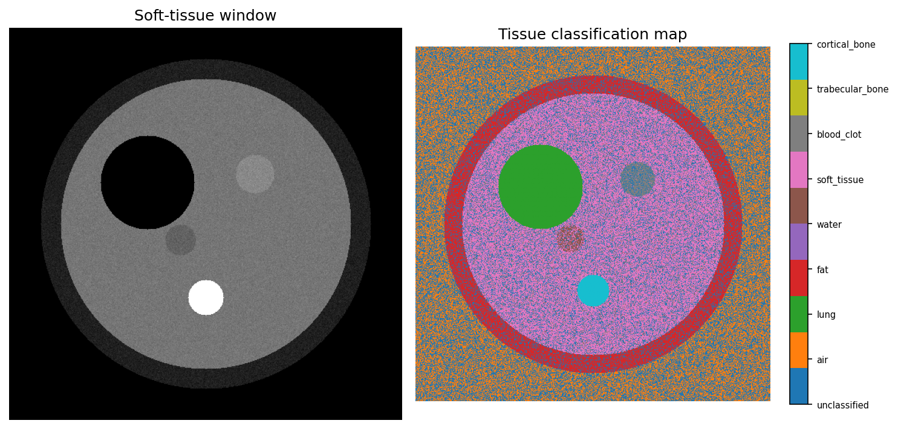

# CT Hounsfield Unit (HU) Analysis

A single Python script that converts CT pixel data into **Hounsfield Units (HU)**,
applies clinical windowing (bone / lung / brain / soft tissue), classifies
tissue by HU range, and visualizes the results.



## Why Hounsfield Units matter

CT scanners measure X-ray attenuation and report it on the standardized
Hounsfield scale:

| Tissue | Typical HU |
|---|---|
| Air | -1000 |
| Lung | -900 to -500 |
| Fat | -120 to -90 |
| Water | 0 |
| Soft tissue | 10 to 40 |
| Blood clot | 50 to 75 |
| Trabecular bone | 300 to 400 |
| Cortical bone | 400 to 3000 |

This is the basis of clinical windowing (how radiologists adjust contrast
to see bone vs. lung vs. soft tissue) and of HU-based tissue segmentation.

## What the script does

1. `pixels_to_hu()` — converts raw pixel values to HU (`HU = pixel * slope + intercept`)
2. `apply_window()` — applies bone/lung/brain/soft-tissue window presets
3. `classify_tissue()` — labels each pixel by tissue type using HU ranges
4. `generate_ct_phantom()` — builds a synthetic CT-like slice, so the script
   runs without needing real patient data (no privacy concerns for a public repo)
5. Saves three plots: window comparison grid, HU histogram, tissue map

## Run it

```bash
pip install numpy matplotlib
python ct_hu_analysis.py
```

To use a real DICOM series instead of the synthetic phantom:

```bash
pip install pydicom
python ct_hu_analysis.py --dicom /path/to/dicom_folder
```

Output plots and a printed tissue-composition report are saved to `output/`.

## Notes

- HU reference ranges are standard textbook approximations.
- The synthetic phantom is a simplified geometric approximation, not a
  validated anatomical phantom.
- Educational / portfolio project — not a diagnostic tool.

## Author

Built by Fiza, a Medical Imaging Technology graduate exploring AI engineering
for medical imaging.
